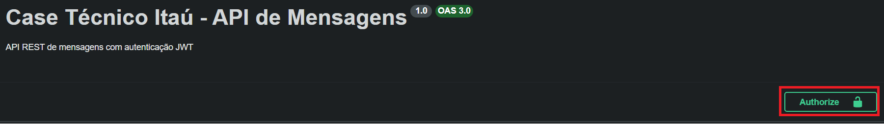

# Case Técnico Itaú - API REST de Mensagens

Este projeto é uma API REST desenvolvida com NestJS para atender aos requisitos do case técnico do Itaú.

## Funcionalidades

- Autenticação via JWT
- Cadastro de Mensagens
- Listagem de Mensagens (filtro por remetente e/ou período e paginação/ordenação por data)
- Busca de Mensagens por ID
- Atualização de Status de Mensagens

## Stack

- NestJS
- DynamoDB (via NestJS Dynamoose)
- Zod e Class Validator para validação de dados
- Jest, Supertest e Testcontainers para testes
- NestJS Pino para logs estruturados
- Swagger para documentação
- Eslint e Prettier para formatação do código
- Datadog para observabilidade (com nestjs-ddtrace e agente rodando no docker)

## Estrutura de pastas

```
src/
├── config/                       # Configurações e validações de variáveis de ambiente (ConfigService)
├── decorators/                   # Decorators customizados reutilizáveis pela aplicação
│   └── tests/                    # Testes unitários dos decorators
├── guards/                       # Guards do NestJS (autenticação, throttling, etc.)
│   └── tests/                    # Testes unitários dos guards
├── lib/                          # Configurações de bibliotecas terceiras que não são Injectables ou Módulos do NestJS
│   ├── datadog/                  # Inicialização do tracer do datadog
│   ├── dynamoose/                # Configurações e modelos do Dynamoose (DynamoDB)
│   │   ├── exceptions/           # Exceções customizadas relacionadas ao Dynamoose
│   │   └── schemas/              # Schemas do Dynamoose
│   │       ├── message/          # Schemas do modelo Message
│   │       └── rate-limit/       # Schemas do modelo de Rate Limit
│   ├── express/                  # Tipagens auxiliares relacionadas ao Express
│   └── swagger/                  # Configurações do Swagger
├── modules/                      # Módulos da aplicação
│   ├── auth/                     # Módulo de autenticação
│   │   ├── docs/                 # Decorators de documentação do Swagger para casos em que a documentação do Swagger é muito verbosa
│   │   ├── request/              # DTOs de requisições
│   │   ├── response/             # DTOs de resposta
│   │   ├── tests/                # Testes
│   │   └── use-cases/            # Casos de uso
│   ├── messages/                 # Módulo de mensagens
│   │   ├── docs/                 # Decorators de documentação do Swagger do módulo de mensagens
│   │   ├── repositories/         # Camada de repositório (acesso a dados) de mensagens
│   │   ├── request/              # DTOs de requisições
│   │   ├── response/             # DTOs de resposta
│   │   ├── tests/                # Testes
│   │   └── use-cases/            # Casos de uso
│   └── rate-limit/               # Módulo de Rate Limit (Throttler)
│       └── storage/              # Implementação custom de storage do Throttler (persistido em DynamoDB)
├── tests/                        # Utilitários compartilhados de testes
│   └── fixtures/                 # Fixtures e helpers reutilizados pelos testes
├── types/                        # Tipos/Interfaces compartilhados pela aplicação
└── utils/                        # Funções utilitárias simples
```

## Como rodar localmente

### 1. Clone o repositório

```bash
git clone https://github.com/carloscastrodev/challenge-itau.git
```

### 2. Copie o arquivo .env.example para .env

```bash
cp .env.example .env
```

### 2.1 (Opcional) Configurar o DataDog no .env

```bash
Modifique a variável DD_API_KEY= no .env com a sua chave do DataDog
```

### 3. Inicie a aplicação com o Docker

```bash
docker compose up -d (para rodar em segundo plano)
ou
docker compose up --attach backend (para ver os logs da aplicação no terminal)
```

OU

```bash
npm run start:docker

ou

yarn start:docker

```

(_isso equivale a rodar o comando `docker compose up --attach backend`_)

### 4. Acesse o Swagger para testar a aplicação

```bash
http://localhost:3001/api/docs
```

## Testes

(_Precisa do docker instalado e rodando para alguns dos testes de integração, pois estou utilizando testcontainers_)
Para rodar os testes, utilize os comandos:

```bash
npm install | yarn install - Instalar dependências
```

```bash
npm run test:unit | yarn test:unit - Testes Unitários
npm run test:e2e | yarn test:e2e - Testes de Integração
```

## Autenticação

- A autenticação é realizada pelo endpoint `POST /v1/sign-in`. O mecanismo de autenticação é baseado em usuário e senha, devolvendo um token de acesso JWT.

## Credenciais de teste padrão (.env.example)

```
 username: user
 password: password
```

## Como usar o token

O token JWT é gerado pelo endpoint `POST /v1/sign-in` e deve ser enviado no header `Authorization` com o prefixo `Bearer`.

```
Authorization: Bearer <token>
```

Pelo Swagger, isso é feito clicando botão Authorize


Em seguida, insira o JWT no campo do modal aberto.

## Diagrama da API

Como não fiz nada muito complexo em termos arquiteturais, o diagrama é apenas um fluxograma dos casos de uso (autenticação e mensagens), incluindo os componentes do sistema por onde a requisição percorre. Inclui algumas explicações sobre os GSIs aplicados na tabela do DynamoDB, além das ferramentas de observabilidade (Pino, Datadog).


## Uso de Agentes de IA (Claude Code)

- Utilizei o Claude para:
  - gerar parte dos testes de integração de mensagens e solucionar alguns bugs que estava tendo na minha implementação inicial (dos testes e dos endpoints de listagem com filtros);
  - ponderar sobre a modelagem do banco em relação ao uso de GSIs vs denormalização dos dados;
  - implementação da classe de storage do Throttler do NestJS (Rate Limit com Janela Fixa);
  - auxilio na escrita do docker-compose (dd-agent);
  - review final do código e aderência com os requisitos (isso me lembrou de alguns pontos que eu já havia pensado mas não havia documentado nesse README);
  - ajudar a melhorar a formatação desse README.

Em alguns pontos da aplicação estão alguns comentários onde utilizei/como utilizei.

## Decisões Técnicas

## Autenticação

- Decidi não implementar autenticação no banco de dados ou em serviços de IdP como o Cognito, optando por usar credenciais mockadas por simplicidade.

### Escolha do Dynamoose

- Escolhi o [Dynamoose](https://dynamoosejs.com/) porque vi que ele é parecido com o Mongoose (que eu tenho alguma experiência), e por já existir um pacote de integração com NestJS.
- Cogitei usar o [ElectroDB](https://electrodb.dev) ou o SDK oficial da AWS para dynamodb, mas acabei optando pelo Dynamoose.

### Escolha do Pino (Logger)

- Escolhi o [Pino](https://getpino.io) em vez do Winston (ou outro logger) porque vi que ele é mais leve e performático. Não tinha experiência com nenhum.
- Optei por usar a biblioteca [NestJS-Pino](https://github.com/iamolegga/nestjs-pino) porque ela vincula e loga automaticamente os dados da requisição.

### Sobre a modelagem de dados

- Para suportar os padrões de acesso requisitados, criei dois GSIs na tabela, optando por utilizar nomes genéricos (abordagem para tabela única). Tentei pensar em como suportar os padrões de acessos sem necessidade de GSIs, mas não consegui encontrar uma forma eficiente de fazer isso. Cheguei a cogitar (pesquisando no Claude) a duplicação dos dados (modificando a partition key e sort key) mas descartei essa ideia e optei pelos GSIs.
- O requisito do case diz "data de envio". Eu mapeei isso pra "createdAt" mas talvez deveria ser algo separado e fornecido na requisição pelo cliente?
- O requisito do case especifica as strings de status em negrito. Eu primeiramente implementei o enum de status com strings em inglês, mas considerando que as strings estavam em negrito no case eu acabei alterando pros valores fornecidos. Fiquei um pouco confuso aqui.

## Sobre as APIs de criação e de atualização de status

- A API de criação recebe do cliente o status inicial da mensagem. Talvez isso seja incorreto, e na criação eu deveria sempre colocar o status como "enviado". Confesso que com relação as regras de negócio eu talvez não tenha tido a melhor interpretação. Eu cogitei ambos os casos e escolhi o mais abrangente.
- Da mesma forma, a API de atualização permite atualizar de qualquer status para qualquer status (Ex: uma mensagem dada como "recebido" pode ser atualizar para "enviado"). Novamente aqui eu cogitei validar e não permitir transições de status inválidas ("recebido"-> "enviado", "lido" -> "enviado", "lido" -> "recebido"), mas por fim optei pela implementação mais abrangente.

## Sobre a API de busca

- Nesse quesito eu talvez deveria retornar o cursor (lastKey) para paginação (uma vez que a API deveria estar apta a receber um frontend futuramente). Eu optei por interpretar o range de datas como meu cursor de paginação (Ex: filtra uma lista, pega a data da última mensagem de lista e envia como o cursor da próxima página). Aqui existe um pequeno problema, no entanto: o filtro por período é inclusivo nos dois limites, então a próxima página iria retornar a mesma mensagem do final da página anterior. Isso seria facilmente resolvido tornando o limite inferior exclusivo. Novamente fiquei em dúvida com relação ao esperado pela regra de negócio e optei pelo mais abrangente.
- A API de busca apenas por período utiliza bucketing das mensagens por data. Aqui eu poderia ter feito uma busca serial, o que não causaria overfetch, mas talvez fosse mais lenta. Optei por uma busca paralela nos buckets e limitação na própria aplicação. Tem um comentário explicando um pouco melhor no próprio arquivo `src/modules/messages/repositories/message.repository.dynamoose.ts`. Um pequeno porém sobre isso é que eu não limitei o range da busca (endDate - startDate <= _x_ dias). Em larga escala isso provavelmente ocasionaria um gargalo de performance para uma busca com um range muito grande. Mais uma vez, como não sabia o esperado optei pela implementação mais abrangente.

### Use Cases vs Service

- Aqui simplesmente optei pelo que estou mais acostumado atualmente, mas talvez a nomeclatura dos arquivos tenha fugido um pouco do padrão que apliquei no restante do projeto.

### Repositório

- Tentei isolar o acesso ao banco de dados (DynamoDB) na camada de repositório. A intenção aqui é que fosse possível modificar o banco de dados apenas alterando essa camada, sem modificação das regras de negócio. Não sei se consegui atingir o objetivo aqui.

## Rate limit na autenticação

- Rate limit em rotas de autenticação é um padrão comum, para evitar ataques de brute-force. Aqui usei o pacote throttler do nest junto com um storage custom (no próprio DynamoDB). A implementação do storage fiz com ajuda do Claude. Optei por utilizar o próprio DynamoDB aqui simplesmente para exercitar o design de single table (e por não ter experiência com redis). Poderia ter utilizado essa [biblioteca](https://github.com/jmcdo29/nest-lab/tree/main/packages/throttler-storage-redis), mas preferi seguir com o DynamoDB. A implementação ficou um pouco inocente. É uma janela fixa que não considera se o usuário acertou o errou a senha, então teoricamente um usuário com rate limit mesmo acertando a senha na próxima requisição ficaria bloqueado por um tempo até conseguir logar. Talvez para melhorar esse ponto poderia ter pensado em uma forma de incrementar a duração dos bloqueios progressivamente após cada rate limit, mas optei por não fazer.

## Por que mais testes de integração do que unitários?

- Eu particularmente prefiro testar a aplicação de forma mais similar a como um usuário iria interagir com ela. Em testes unitários eu acabo tendo que criar muitos mocks, e parece que eu estou testando mais a implementação de certas coisas do que sua interface propriamente. Talvez eu esteja fazendo isso de forma incorreta? De qualquer forma eu acredito que testes de integração (com banco de dados de teste, etc.) são mais interessantes e fiéis ao que seria o comportamento real da aplicação. Eu poderia ter escrito mais testes unitários, mas acho que a quantidade de testes que escrevi já é o suficiente para um case técnico de entrevista.

## Observabilidade (Datadog)

- Nesse quesito eu tenho mais experiência com [Sentry](https://sentry.io). A integração com o Nest é bem simples e já traz muitas coisas de forma automática (traces, metrics, logs, alerts, etc).
- Eu decidi tentar utilizar alguma outra ferramenta com a qual não tenho experiência, por simples aprendizado.
- Primeiramente cogitei utilizar o [Better Stack](https://betterstack.com) porque eu ouvi falar dele recentemente e queria ver o processo de integração/interface do mesmo (por puro aprendizado). Após configurar o opentelemetry e observar alguns traces no painel eu vi que teria que fazer muita coisa manualmente para ter o mesmo que o Sentry oferece de forma automática.
- Por fim acabei testando e mantendo o [DataDog](https://www.datadoghq.com) (que é citado no próprio desafio e sei que é um padrão para aplicações distribuídas, e com o qual eu também não tinha experiência). A escolha casou bem com o Pino porque ele já gera logs no formato correto para vincular com os traces do DataDog.
